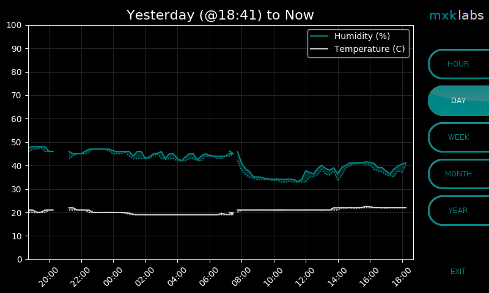

mxklabs - IoT Dashboard
===============================

# Introduction

This project implements a simple IoT dashboard on a Raspberry Pi (with touchscreen display), currently featuring relative humidity and temperature monitoring. Using the touch screen interface the user can view sensor readings over the last day, week, month or year. For larger time ranges values are plotted as a band, showing both the minimum and maximum extremes. 
All sensor information is stored in file-backed buffers, meaning that data is not lost following power cycles.

For context, the main reason I created this project was due to the purchase of an accoustic piano with strict warranty conditions on humidity in particular. This monitoring application allows me to verify I meet those conditions.



**NOTE**: *This code is not production quality. I decided to share it in case it is useful to someone else.*

# Installation

## Hardware & setup

This code is designed to run on a Raspberry Pi with the official touchscreen
display. We recommend using these products:

* [Raspberry Pi 3 Model B](https://www.raspberrypi.org/products/raspberry-pi-3-model-b/)
* [Raspberry Pi Touch Display](https://www.raspberrypi.org/products/raspberry-pi-touch-display/)
* [Raspberry Pi Universal Power Supply](https://www.raspberrypi.org/products/raspberry-pi-universal-power-supply/)
* [Velleman VMA311 with DHT11 Sensor](https://www.velleman.eu/downloads/29/vma311_a4v01.pdf)
* [Huzzah Feather board](https://www.adafruit.com/product/2821)

You will also need some female-to-female jumper wires, some 0.1" strip male headers that need to be soldered onto the Huzzah and a micro USB cable. The temperature/humidity sensor is a DHT11 chip packaged on the Velleman VMA311 board. We interface this sensor with an Arduino-like board called called the Huzzah Feather. This board, in turn, transmits temperature and humidity information on it's USB serial interface. This information is read by an application running on the Pi.

**NOTE**: *There is no real need to use a Huzzah Feather -- it's pretty straight forward to interface the HDT11 sensor directly from the Pi (see, e.g., [here](http://www.circuitbasics.com/how-to-set-up-the-dht11-humidity-sensor-on-the-raspberry-pi/)) but the Huzzah was something I wanted to play with.*

Finally, you will also need a variety of other things to get up and running (like a
micro SD card with the latest [Raspbian Stretch](https://www.raspberrypi.org/downloads/raspbian/)
image, a display, a keyboard, etc.). This guide assumes you already have a
[Raspberry Pi](https://www.raspberrypi.org/products/raspberry-pi-3-model-b/)
up and running with a [Raspbian Stretch](https://www.raspberrypi.org/downloads/raspbian/)
OS and the official [Touch Display](https://www.raspberrypi.org/products/raspberry-pi-touch-display/).
If this is not the case you find some basic guides
[here](https://www.imore.com/how-get-started-using-raspberry-pi),
[here](https://www.digikey.com/en/maker/blogs/raspberry-pi-3-how-to-configure-wi-fi-and-bluetooth/03fcd2a252914350938d8c5471cf3b63) and
[here](https://thepihut.com/blogs/raspberry-pi-tutorials/45295044-raspberry-pi-7-touch-screen-assembly-guide).

## Setting up the Huzzah

In terms of wiring, you need to connect up the following:

| Huzzah pin    | Velleman VMA311 PIN |
| ------------- | ------------------- |
| Pin GND       | Pin '-' (right)       |
| Pin 3v        | Pin '+' (middle)      |
| Pin 14        | Pin S (left)        |

You will also need to connect the Huzzah to your development PC via a micro USB cable. 

* Download [Arduino IDE](https://www.arduino.cc/en/main/software).
* Configure Arduino IDE using [this guide](https://randomnerdtutorials.com/how-to-install-esp8266-board-arduino-ide/).
* Load the `huzzah/huzzah.ino` project.
* Click 'upload'.

If you use the serial monitor at 115200 baud you should now see humidity and temperature readings.

## Setting up the Pi

Our application requires [Python 3](https://www.python.org/downloads/) (already
installed on [Raspbian Stretch](https://www.raspberrypi.org/downloads/raspbian/))
with some additional dependencies:

* Install six (a python 2/3 compatibility library):

   ```
   sudo python3 -m pip install --upgrade six
   ```

* Install mxklab (our own python library which includes the implementation of a file-backed buffer):

   ```
   sudo python3 -m pip install --upgrade mxklabs
   ```

* Install mxklab (our own python library which includes the implementation of a file-backed buffer):

   ```
   sudo python3 -m pip install --upgrade mxklabs
   ```
   
* Install matplotlib (a library for plotting data):

   ```
   sudo python3 -m pip install --upgrade matplotlib
   ```

**NOTE**: *This dependency list may be out of date. If you do try this please let me know either way!*

## Connecting the Huzzah to the Pi

To connect the Huzzah and the Pi simply use a micro USB cable.

Now you should be able to start the monitor with the following command:

```
python3 /home/pi/mxklabs-iot-dashboard/pi/app/main.py
```

If you do not have a monitor and you are SSH-ing to the Pi, use the following command line to start the GUI on the Pi:

```
DISPLAY=:0 /usr/bin/python3 /home/pi/mxklabs-iot-dashboard/pi/app/main.py
```

## Post-Installation Tweaks

* To turn your screen upside down add the line `rotate_lcd=2` to the top of `/boot/config.txt`.
* To auto-start the application on startup add `@/usr/bin/python3 /home/pi/mxklabs-iot-dashboard/pi/app/main.py`
to the bottom of `/home/pi/.config/lxsession/LXDE-pi/autostart`.
* To set the brightness of the display set `/sys/class/backlight/rpi_backlight/brightness`
to a number between `0` (dark) and `255` (bright).
* To force the screen to stay on add `xserver-command=X -s 0 dpms` to `/etc/lightdm/lightdm.conf`'s
`[Seats:*]` section.
